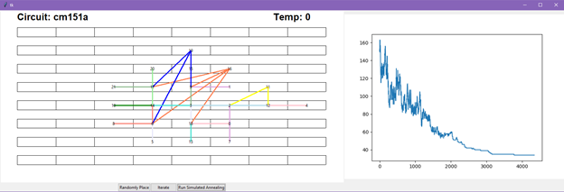
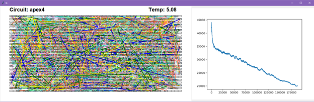

## Introduction

This report describes an implementation of Simulated Annealing (SA) for chip placement. The code is available at https://github.com/lucylufei/CPEN513-assn2

## General Implementation

The application begins by reading the circuit parameters and netlist from the `.txt` file and displaying the cell structure. The annealing schedule can be configured in `settings.py` and the SA algorithm is implemented in `annealing.py`. The program begins with a random placement, then iteratively finds the optimal solution (lowest cost) through SA. 

The GUI shows the current placement of cells and draws wires for each net (in a rat’s nest fashion) and graphs the cost function at each iteration. The graph shows cost on the $y$ axis and the iteration on the $x$ axis. A sample image is included as Appendix A – Sample Output. When the SA exit condition has been met, the final cost will be displayed. 

#### The Cost Function

The cost function is defined as the half-perimeter cost summed over all nets. 
$$
cost = \Sigma_{nets} (x_{max} - x_{min}) + (y_{max} - y_{min})
$$
The terms $x_{min}, y_{min}, x_{max}, y_{max}$ are the corner coordinates of the bounding box for each net.

As stated in the assignment, the following assumptions are interpreted for the cost function:

* There is no penalty for crossing rows (i.e. the routing channel is approximated to be 0 when calculating the half-perimeter).
* The wires are approximated to connect from the center of the cells (i.e. two neighbouring cells have a half perimeter of 1 instead of 2).

A version of the program without these 2 assumptions can be used as well with the `no_assumptions `flag. 

To speed up execution, the cost function is incrementally updated for each move rather than re-calculated. The full cost function calculation is performed after the last move to ensure accuracy.

## The Annealing Schedule

Several configurations for the annealing schedule are implemented and explored. 

#### Starting Temperature

The starting temperature is set as a constant value for all circuits. The initial temperature should be sufficiently large to accept some cost increasing moves at the beginning for all circuits. The only disadvantage to large temperatures is an increased runtime.

#### Moves Per Temperature

The number of moves at each temperature ($n_{moves}$) can be set either as a constant value for all circuits or as a function (below) of the number of cells to be placed ($N$).
$$
n_{moves} = kN^{\frac{4}{3}}
$$
Based on several tests, dynamically selecting the number of moves is more favorable. A large $k$ is not feasible in runtime and doesn’t contribute much additional gain. 

#### Temperature Update

The temperature is lowered using the simple form of $T_{new} = \beta T_{old}$  with  $\beta < 1$ . The value of  $\beta$ must not be too low, as the temperature would drop too quickly, causing quenching. A larger $\beta$  value results in longer runtime. 

#### Exit Strategy

Exiting at a temperature threshold terminates SA too soon, before all the potential optimizations are complete. Exiting after a single iteration with no improvements at a 0 temperature also loses out on potential optimization. The best option seems to be exiting after multiple iterations with no improvements at a 0 temperature at the expense of a slightly longer runtime. 

## Optimizations

Two optimizations are made to improve the SA algorithm. 

### Range Windows

At each iteration of SA, two cells are selected to be swapped. With the range window optimization (`range_window`), the second cell must be within a limited range in distance from the first cell. This generates swaps that are more likely to be accepted and potentially increases the cost function at a slower rate. Notably, this requires a lower starting temperature.

The entire chip can be covered since the first selected cell is chosen randomly without restriction. The second cell can potentially be empty, so there is always a viable choice within the range window. 

The range window is limited by the window_size parameter and determined as a proportion of the full space. Although the range window should be configured to produce a 44% acceptance rate for maximum improvements, this was ignored in the program. 

### Multiple Cell Swaps

There is also a potential benefit from swapping more than just two cells in each iteration. Two types of swaps were explored, however neither produced satisfactory results given that this SA implementation does not use directed moves. 

#### Shuffle [1]

In the shuffle approach, the first cell is moved to the location of the second cell. Then, instead of swapping the second cell to the location of the first cell, it is instead moved to a nearby empty slot. This approach essentially allows a single cell movement per iteration rather than a swap between two cells. 

#### Ripple [2]

The ripple approach expands on the shuffle approach. The first cell is moved in the same way. Then, instead of moving the second cell to a nearby empty slot, a third cell is randomly selected. The second cell moves to the location of the third cell, the third cell moves to the location of a fourth cell, and this process continues until a cell lands in an empty slot. This approach produces a multi-cell swap. However, since no limits were place on the chain reaction, there is usually too many cell swaps to produce a decent result.

## Results

The best results are outlined in Table 1 and the associated annealing schedule is included in Table 2. 

Table 1 - Benchmark Results

| **Circuit**      | **Final  Cost** |
| ---------------- | --------------- |
| pairb            | 5715            |
| cm162a           | 77              |
| e64              | 2004            |
| cm150a           | 67              |
| alu2             | 995             |
| C880             | 1105            |
| cm151a           | 36              |
| cm138a           | 42              |
| apex4            | 11472           |
| paira            | 4327            |
| cps              | 5507            |
| apex1            | 6332            |
| **Average Cost** | **3139.917**    |

 

Table 2 - Annealing Schedule

| **Parameter**              | **Python parameter**  | **Value**                 |
| -------------------------- | --------------------- | ------------------------- |
| Initial temperature        | `start_temperature  ` | 20                        |
| Temperature update         | `temperature_rate  `  | 0.9                       |
| Iterations                 | `dynamic_n_moves  `   | True                      |
|                            | `k_n_moves  `         | 1                         |
| Exit criteria              | `exit_criteria  `     | “multiple_no_improvement” |
|                            | `exit_iterations  `   | 20                        |
| Range window               | `range_window  `      | True                      |
|                            | `window_size  `       | 0.3                       |
| Shuffle                    | `shuffle`             | False                     |
| Ripple                     | `ripple  `            | False                     |
| Half perimeter assumptions | `no_assumptions  `    | False                     |

 

## Application Guide

Run the program with the gui.py file. The graphical display is implemented with `tkinter`, the graphs are produced with `matplotlib`, and the program also requires the `numpy `library. The program can be run under single circuit mode or benchmarking mode (controlled by the single_circuit parameter). This and other various parameters, as well as the annealing schedule, can be configured using `settings.py`.

In single circuit mode, the user is prompted for the name of the circuit for placement. Then, the user can either manually iterate through the process or run the full annealing once using the following buttons:

* **Randomly Place**: Initialize the circuit with an initial random placement.
* **Iterate**: Iterate through `n_moves ` at the current temperature.
* **Run Simulated Annealing**: Run SA on the current circuit. 

In benchmarking mode, all circuits in the `circuits/` folder are executed sequentially and the program begins automatically. 

Table 3 outlines the contents of each Python file.

Table 3 - File Descriptions

| **File Name**       | **Purpose**                                                  |
| ------------------- | ------------------------------------------------------------ |
| `gui.py`            | Main file containing  GUI elements and runs the application  |
| `netlist_parser.py` | Parses the circuit ` .txt ` into an appropriate format for the program |
| `util.py`           | Contains useful  functions shared between algorithms         |
| `annealing.py`      | Implementation  of the SA algorithm                          |
| ` settings.py`      | Contains settings for  the program                           |

 

## Testing Procedure

Testing for this program was completed manually. The **Iterate** option is designed to visibly assess each move and the program also maintains a debugging log file that can be manually checked and cross-referenced with the GUI to ensure the program is proceeding correctly. 

A few extremely simple netlists were also designed as part of the testing procedure. These netlists are small enough to manually cross-check the cost function and ensure there are no missing cells or overlapped placement. 

Otherwise, assertions are included throughout the program and exceptions are raised for unexpected results. 

# Appendix A

[1] K. Vorwerk, A. Kennings and J. W. Greene, "Improving simulated annealing-based FPGA placement with directed moves," *IEEE Transactions on Computer-Aided Design of Integrated Circuits and Systems,* vol. 28, no. 2, p. 179–192, 2009.

[2] Y. Liu, "Toward More Efficient Annealing-Based Placement for Heterogeneous FPGAs", University of Toronto, 2014.